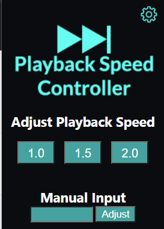
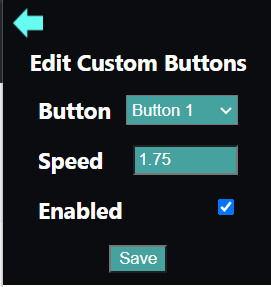
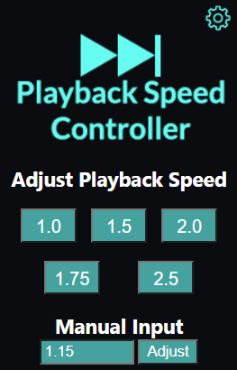

# Playback Speed Controller - Chrome Extension

## Summary
This Google Chrome extension allows the user to control the playback speed of videos. This extension works with most browser video players (e.g. Youtube, Netflix, Hulu, Amazon, Panapto).

## Features
- The user can use the extensions pre-made buttons to adjust playback speed 
  - 
- Manually input a value for playback speed
  - 
- Create their own custom playback button 
  - 

## Installation
- Download the Github repo
- Navigate to the extension settings in your Chrome browser (chrome://extensions/)
- Enable developer mode
- Select "Load Unpacked" button
- Select the saved repo's file location
- Enable the extension
